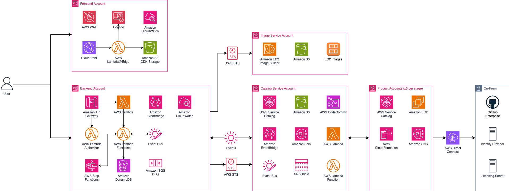
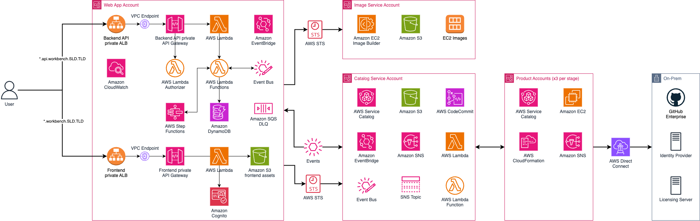

# Virtual Engineering Workbench (VEW)

Modern engineering organizations — particularly in automotive, manufacturing, and embedded systems — face a common set of challenges:

- **Hardware scarcity**: Physical prototypes and development boards are expensive and in short supply during early development stages.
- **Environment complexity**: Setting up toolchains, simulators, and IDEs for embedded development takes days or weeks per developer.
- **Collaboration barriers**: Distributed teams need shared, reproducible environments that work identically regardless of location.
- **Slow feedback loops**: Validating software against virtual targets should happen continuously, not only when hardware is available.

VEW addresses these by providing a unified platform where platform engineers define and publish ready-to-use development environments (workbenches), and developers provision them on demand through a web portal.

## Business use cases

| Use case | How VEW helps |
| --- | --- |
| Cloud-based development environments | Pre-configured workbenches with IDEs, compilers, and debuggers — launched in minutes |
| Virtual target simulation | Run software-in-the-loop (SiL) tests against virtual hardware models in the cloud |
| AMI factory | Automated, repeatable image creation using EC2 Image Builder with versioned components and recipes |
| Multi-tenant project isolation | Separate environments, access controls, and cost tracking per project and team |
| Self-service provisioning | Developers browse a product catalog and launch workbenches without filing tickets |
| Remote desktop access | Secure browser-based access to Windows and Linux workbenches via Amazon DCV |

## Core pillars

- **Tools** — Pre-configured development environments, IDEs, and toolchains
- **Targets** — Platform abstraction, virtualization, and target configurations
- **Environments** — Validation infrastructure, simulation, and test data
- **Automation** — CI/CD, environment provisioning, and artifact management
- **Self-Service Portal** — RBAC, project management, and workflow orchestration

## Architecture overview

VEW is built on AWS serverless technologies using hexagonal architecture with Domain-Driven Design (DDD) patterns. The platform separates business logic from infrastructure through bounded contexts, each independently deployable.

VEW supports two deployment modes:

- **Public** — CloudFront + Lambda@Edge + S3 for the frontend, public API Gateway endpoints. Suitable when users access the platform over the internet.
- **Private** — Application Load Balancer within a VPC for the frontend, private API Gateway endpoints via VPC endpoints. Suitable when the platform must remain within a corporate network.

### Public deployment



### Private deployment



### Technology stack

| Layer | Technology |
| --- | --- |
| Backend | Python 3.13, AWS Lambda, Lambda Powertools |
| API | Amazon API Gateway (REST) with both Lambda and IAM authorization |
| Database | Amazon DynamoDB |
| Frontend | React 18, TypeScript, Vite, Cloudscape Design System |
| Authentication | Amazon Cognito with OIDC/SAML federation |
| CDN and protection | CloudFront, Lambda@Edge, WAF |
| Events | Amazon EventBridge (bus, pipes, scheduler) |
| Orchestration | AWS Step Functions, AWS Service Catalog |
| Image building | EC2 Image Builder |
| Infrastructure | AWS CDK v2 (Python for backend, TypeScript for frontend) |

### Bounded contexts

Each bounded context is an independent service with its own API, data store, and deployment:

| Context | Purpose |
| --- | --- |
| **Authorization** | API authorization and permission validation using Cedar policies |
| **Projects** | Project lifecycle, membership, enrollment, and resource allocation |
| **Packaging** | AMI components, recipes, EC2 Image Builder pipelines and images |
| **Publishing** | Service Catalog products, versions, and portfolio management |
| **Provisioning** | Product launch/terminate, workbench lifecycle management |
| **Usecase** | Minimal skeleton demonstrating how a new bounded context plugs into a use-case account (template/reference) |
| **Shared** | Common utilities, DDD helpers, middleware, instrumentation |

### Design patterns

- **Hexagonal architecture** — Domain logic at the center, ports define contracts, adapters implement infrastructure
- **CQRS** — Separate command handlers (writes) from query services (reads)
- **Repository + Unit of Work** — Transactional consistency for DynamoDB operations
- **Domain Events** — EventBridge for cross-context communication
- **Value Objects** — Self-validating DTOs with factory methods

## Repository structure

```text
├── backend/              # Python Lambda application + CDK infrastructure
│   ├── app/              # Application code (bounded contexts)
│   ├── infra/            # CDK stacks, constructs, and configuration
│   └── setup/            # CloudFormation prerequisites (spoke account bootstrap)
│
├── frontend/             # React web application + CDK infrastructure
│   ├── infrastructure/   # CDK stacks (Cognito, CloudFront, S3, WAF)
│   └── web/              # Main web application (Vite, Cloudscape)
│
├── deploy.sh             # Automated deployment script (10 phases)
└── config.env            # Sample deployment configuration
```

See [backend/README.md](backend/README.md) and [frontend/README.md](frontend/README.md) for detailed structure, setup, and development instructions.

## Deployment

> **Region constraint:** Deploy to **us-east-1** only. WAFv2 WebACLs with `CLOUDFRONT` scope must be created in us-east-1. The frontend CDK stack does not handle cross-region WAF deployment. Deploying to other regions will fail during frontend stack creation.

### Prerequisites

| Requirement | Version | Purpose |
| --- | --- | --- |
| AWS CLI | v2 | AWS resource management |
| AWS CDK | v2 | Infrastructure deployment |
| Node.js | 24+ | Frontend build, CDK (TypeScript) |
| Python | 3.13+ | Backend application, CDK (Python) |
| uv | 0.11+ | Python dependency management |
| Yarn | 4.x | Frontend package management |
| jq | any | JSON processing in deploy script |
| Docker | any | Required on macOS/Windows for Lambda bundling and ECS image builds. On Linux, only needed for ECS task image builds. |

You also need:

- An AWS account with credentials configured (admin or PowerUser access for initial deployment)
- The account must be part of an AWS Organization (the deploy script reads the Organization ID)
- TLS certificates in ACM (optional — for custom domains)
- OIDC client credentials (optional — for corporate login federation)

### Ubuntu / WSL setup

```bash
# System packages
sudo apt update && sudo apt install -y software-properties-common jq docker.io unzip curl

# Python 3.13
sudo add-apt-repository -y ppa:deadsnakes/ppa
sudo apt update && sudo apt install -y python3.13 python3.13-venv python3.13-dev
sudo update-alternatives --install /usr/bin/python3 python3 /usr/bin/python3.13 2

# Node 24 + Yarn 4
curl -fsSL https://deb.nodesource.com/setup_24.x | sudo -E bash -
sudo apt install -y nodejs
sudo npm install -g aws-cdk
sudo corepack enable
corepack prepare yarn@4.13.0 --activate

# uv (Python package manager)
curl -LsSf https://astral.sh/uv/install.sh | sh

# AWS CLI v2
cd /tmp
curl "https://awscli.amazonaws.com/awscli-exe-linux-x86_64.zip" -o "awscliv2.zip"
unzip awscliv2.zip && sudo ./aws/install && rm -rf aws awscliv2.zip

# Docker permissions
sudo usermod -aG docker $USER && newgrp docker
```

**WSL users:** Copy the repository to the Linux filesystem before running the deploy script. Python venvs and Yarn fail on `/mnt/c` (Windows filesystem).

```bash
cp -r /mnt/c/path/to/vew /tmp/vew && cd /tmp/vew
```

### Quick start (Docker)

If you'd rather skip local prerequisite setup entirely, build and run the deployer image. First, create a config file from the provided sample and fill in your values (see [Configuration reference](#configuration-reference) for all available parameters):

```bash
cp config.env deploy-config.env
# Edit deploy-config.env with your values
```

Then build and run:

```bash
docker build -t vew-deployer .
docker run --rm -it \
  -v "$(pwd)":/app \
  -v /var/run/docker.sock:/var/run/docker.sock \
  -e AWS_ACCESS_KEY_ID \
  -e AWS_SECRET_ACCESS_KEY \
  -e AWS_SESSION_TOKEN \
  -e AWS_SPOKE_ACCESS_KEY_ID \
  -e AWS_SPOKE_SECRET_ACCESS_KEY \
  -e AWS_SPOKE_SESSION_TOKEN \
  -e AWS_DEFAULT_REGION=us-east-1 \
  vew-deployer --config /app/deploy-config.env
```

The Docker socket mount (`-v /var/run/docker.sock:/var/run/docker.sock`) is required for ECS task image builds. Pass credentials via environment variables — no AWS profile configuration needed inside the container.

### Quick start

```bash
chmod +x deploy.sh
./deploy.sh
```

The script prompts for all required parameters interactively, then executes 10 phases:

1. Validates prerequisites (`aws`, `cdk`, `node`, `python`, `uv`, `jq`, `yarn`)
1. Patches source configuration files with your org/app prefix and region
1. CDK bootstraps the target account (and `us-east-1` if deploying to another region)
1. Creates prerequisite resources (SSM parameters, VPC, service-linked roles)
1. Configures identity federation (OIDC secret in Secrets Manager)
1. Deploys frontend infrastructure (Cognito, CloudFront, S3, WAF)
1. Deploys backend infrastructure (Lambda, API Gateway, DynamoDB, EventBridge)
1. Builds and uploads the frontend web application to S3
1. Seeds DynamoDB with an admin user and default program
1. Optionally bootstraps a spoke account for workbench provisioning

### Using a config file

```bash
cp config.env deploy-config.env
# Edit deploy-config.env with your values
./deploy.sh --config deploy-config.env
```

The script saves a config file after the first run at `.deploy-config-{env}` for re-runs.

### Configuration reference

Parameters used by `deploy.sh` (prompted interactively or loaded from config file):

| Parameter | Default | Description |
| --- | --- | --- |
| `AWS_ACCOUNT_ID` | — | 12-digit AWS account ID |
| `AWS_REGION` | `us-east-1` | Deployment region |
| `ENVIRONMENT` | `dev` | Environment name (`dev`, `qa`, `prod`) |
| `ORG_PREFIX` | `proserve` | Organization prefix for resource naming |
| `APP_PREFIX` | `wb` | Application prefix for resource naming |
| `ADMIN_EMAIL` | — | Email for the initial admin user |
| `ADMIN_USER_ID` | — | User ID for the initial admin (uppercase) |
| `AWS_PROFILE_HUB` | `default` | AWS CLI profile for the hub (main) account |
| `AWS_PROFILE_SPOKE` | — | AWS CLI profile for the spoke account |
| `OIDC_CLIENT_ID` | — | OIDC client ID (empty = manual Cognito users) |
| `OIDC_CLIENT_SECRET` | — | OIDC client secret |
| `OIDC_ISSUER_URL` | — | OIDC issuer URL |
| `CERT_ARN` | — | TLS certificate ARN in deployment region |
| `CERT_ARN_US_EAST_1` | — | TLS certificate ARN in us-east-1 (required if deploying to another region) |
| `CUSTOM_DOMAIN` | — | Custom domain for the web app (e.g., `dev.workbench.company.com`) |
| `API_CUSTOM_DOMAIN` | — | Custom domain for the API (e.g., `dev.api.workbench.company.com`) |
| `SPOKE_ACCOUNT_ID` | — | Spoke account ID for workbench provisioning |
| `SPOKE_VPC_ID` | — | VPC ID in the spoke account |

Additional configuration not managed by `deploy.sh` (edit manually for private deployments or advanced tuning):

| File | Setting | Default | Description |
| --- | --- | --- | --- |
| `frontend/infrastructure/cdk.json` | `PrivateDeployment` | `false` | `true` for ALB-based private access instead of CloudFront |
| `frontend/infrastructure/cdk.json` | `VPCName` | `default-vpc` | VPC name for ALB placement (private deployment) |
| `frontend/infrastructure/cdk.json` | `RequireCustomUserLogin2FA` | `true` | Require MFA for Cognito-native users |
| `frontend/infrastructure/cdk.json` | `CustomLoginDNSEnabled` | `false` | Enable custom DNS for Cognito login page |
| `backend/infra/constants.py` | `PRIVATE_API_ENDPOINT` | `False` | `True` for private API Gateway via VPC endpoints |
| `backend/infra/config.py` | `rest-api-cors-origins` | `*` | Restrict to your domain in production |
| `backend/infra/config.py` | `retain_resources` | `False` | `True` in production to prevent data loss on stack deletion |
| `backend/infra/config.py` | `backup-resources` | `False` | `True` in production to enable DynamoDB PITR and S3 versioning |
| `backend/infra/config.py` | `enabled-workbench-regions` | `["us-east-1"]` | Regions where workbenches can be provisioned |
| `backend/infra/config.py` | `allowed-cidrs-for-private-api-endpoint` | RFC 1918 ranges | CIDR ranges allowed to reach private API endpoints |
| `backend/infra/config.py` | `user-role-stage-access` | all roles → `["dev"]` | Which spoke account stages each VEW role can provision into |
| `backend/infra/config.py` | `disabled-components` | `[]` | Bounded contexts to disable per environment |
| `backend/infra/config.py` | `product-limit-version` | `5` | Max product versions in the publishing catalog |
| `backend/infra/config.py` | Lambda concurrency settings | `10` reserved, `1` provisioned | Per-function concurrency (tune for expected load) |

### What gets patched

The deploy script replaces default values in source files before deploying:

| File | What changes |
| --- | --- |
| `backend/infra/config.py` | Org/app prefix, Cognito region, enabled workbench regions |
| `backend/infra/constants.py` | Lambda architecture (ARM/x86), local bundling flag |
| `frontend/infrastructure/cdk.json` | App name, deployment qualifier, OIDC secret name |
| `frontend/infrastructure/lib/public-access-deployment-stack.ts` | Monitoring resource name prefix |

If you deploy with the defaults (`proserve`/`wb`/`us-east-1`), no patching occurs.

### Post-deployment

After deployment completes, the script prints:

- The CloudFront URL for the web application
- Admin credentials
- The `aws cognito-idp admin-create-user` command (if no OIDC was configured)

DNS records for custom domains must be created manually after the first deployment.

### Cost estimate

Approximate monthly cost for a minimal deployment (us-east-1, no active workbenches):

| Service | Estimated cost |
| --- | --- |
| CloudFront | ~$1 (minimal traffic) |
| Cognito | Free tier (< 50k MAU) |
| Lambda | Free tier (< 1M requests/month) |
| API Gateway | ~$3.50 per million requests |
| DynamoDB | ~$5 (on-demand, minimal usage) |
| S3 | < $1 (static assets) |
| WAF | ~$11 (3 WebACLs × $5 + rules) |
| EventBridge | < $1 |
| Step Functions | < $1 |
| **Total (idle)** | **~$25–35/month** |

Active usage with workbenches adds EC2 instance costs in the spoke account. Use AWS Cost Explorer with the `{org}-{app}-*` tag pattern to track VEW-specific spending.

### Spoke account onboarding

Workbenches are provisioned in spoke accounts, separate from the main platform account. To onboard a spoke account, either provide the spoke account ID during the interactive prompt, or deploy the bootstrap template manually:

```bash
aws cloudformation deploy \
  --template-file backend/setup/prerequisites/vew-spoke-account-bootstrap.yml \
  --stack-name VEW-Spoke-Bootstrap \
  --capabilities CAPABILITY_NAMED_IAM \
  --parameter-overrides \
    WebApplicationAccountId=<MAIN_ACCOUNT_ID> \
    WebApplicationEnvironment=dev \
    VPCIdParameterValue=<SPOKE_VPC_ID>
```

This must be deployed into the spoke account, not the main account.

VEW comes pre-configured with a tag based VPC subnet selection strategy to provision workbenches. Subnet selection is defined in [backend/infra/config.py](backend/infra/config.py), `provisioning-subnet-selector` setting. Available subnet selection strategies are:

- _TaggedSubnet_ (default) - filters for subnets tagged with a tag specified in the `provisioning-subnet-selector-tag` setting.
- _PublicSubnet_ - selects a public subnet. Use this for testing purposes only.
- _PrivateSubnetWithTransitGateway_ - selects a private subnet that has a transit gateway route. Use it when workbenches need to be accessible only from the corporate network.

All of the subnet selection strategies pick a subnet with the most remaining IPs left.

If you specify the `SPOKE_ACCOUNT_ID` parameter and leave the `SPOKE_VPC_ID` blank, the deploy script will create a new VPC with public subnets ready for provisioning. If you specify a `SPOKE_VPC_ID` value, then you must tag the subnets on the spoke account using `ProvisioningEnabled` key and `True` value.

## Using VEW

Once deployed, VEW follows a three-stage workflow to deliver development environments to end users:

### 1. Packaging — Build machine images

Platform engineers define what goes into a workbench image:

1. Create **components** — individual software installation and test steps (mapped to EC2 Image Builder components)
1. Assemble components into **recipes** — ordered lists of software to include (mapped to Image Builder recipes)
1. Create **pipelines** — automated builds that produce AMIs from recipes (mapped to Image Builder pipelines)
1. Run the pipeline to produce a tested, versioned **image**

### 2. Publishing — Create products in the catalog

Platform engineers make images available to users:

1. Create a **product template** — CloudFormation template defining network, security groups, instance type, storage, and the AMI reference
1. Create a **product** from the template and publish it to the Service Catalog portfolio
1. Create **product versions** as images evolve

### 3. Provisioning — Launch and manage workbenches

Developers use the self-service portal to:

1. Browse **available products** in the catalog
1. **Launch** a product — VEW provisions the underlying EC2 instance via Service Catalog
1. **Start/stop** provisioned products to control costs
1. **Connect** to running workbenches via browser (Amazon DCV) or SSH
1. **Terminate** products when no longer needed

## Getting started

If you just deployed VEW and want to see it in action, start here:

- [Build your first product](examples/freertos/README.md) — create a FreeRTOS virtual target from scratch: component, recipe, pipeline, product, and a running instance you can SSH into.
- [Launch a product](docs/launch-a-product.md) — provision any product from the catalog.
- [Connect to a product](docs/connect-to-a-product.md) — reach your running product via browser, DCV client, or SSH.

More examples (Android Cuttlefish, QEMU/KVM) are in the [examples/](examples/) folder.

## Extending VEW

### Adding a new backend bounded context

See [backend/README.md — Extending the backend](backend/README.md#extending-the-backend) for the full walkthrough with code examples covering entrypoints, command handlers, bootstrappers, domain events, and CDK stacks.

Key architectural rules enforced by automated fitness function tests:

- Dependencies point inward only — domain code must never import from adapters or entrypoints
- Bounded contexts are isolated — no imports between contexts
- Ports are owned by the domain — adapters implement domain-defined interfaces
- Cross-context communication uses EventBridge events, not direct imports

### Extending the frontend

See [frontend/README.md — Extending the frontend](frontend/README.md#extending-the-frontend) for adding pages, generating API clients, and UI patterns.

## Security

- JWT and IAM authorization on API Gateway
- JWT validation via Lambda@Edge on every request
- Corporate identity federation through Cognito OIDC/SAML
- WAF on CloudFront, Cognito, and API Gateway with AWS managed rule groups (anonymous IP, IP reputation, known bad inputs, common exploits)
- KMS encryption for AMI artifacts and SNS alarm topics
- Cedar-based fine-grained authorization (Amazon Verified Permissions)

See [CONTRIBUTING](CONTRIBUTING.md#security-issue-notifications) and [SECURITY.md](SECURITY.md) for more information.

## References

- [Stellantis' SDV transformation with the Virtual Engineering Workbench on AWS](https://aws.amazon.com/blogs/industries/stellantis-sdv-transformation-with-the-virtual-engineering-workbench-on-aws/)
- [How Stellantis built the serverless self-service portal for the Virtual Engineering Workbench](https://aws.amazon.com/blogs/industries/how-stellantis-built-the-serverless-self-service-portal-for-the-virtual-engineering-workbench/)
- [How Schaeffler AG accelerates automotive software development by leveraging the AWS Virtual Engineering Workbench Framework](https://aws.amazon.com/blogs/industries/how-schaeffler-ag-accelerates-automotive-software-development-by-leveraging-the-aws-virtual-engineering-workbench-framework/)
- [How Schaeffler uses generative AI to accelerate automotive software testing](https://aws.amazon.com/blogs/industries/how-schaeffler-uses-generative-ai-to-accelerate-automotive-software-testing/)
- [How Stellantis streamlines floating license management with serverless orchestration on AWS](https://aws.amazon.com/blogs/architecture/how-stellantis-streamlines-floating-license-management-with-serverless-orchestration-on-aws/)
- [Building hexagonal architectures on AWS](https://docs.aws.amazon.com/prescriptive-guidance/latest/hexagonal-architectures/welcome.html)
- [Cloudscape Design System](https://cloudscape.design/)

## Authors

See [AUTHORS.md](AUTHORS.md).

## License

This project is licensed under the Apache-2.0 License.
