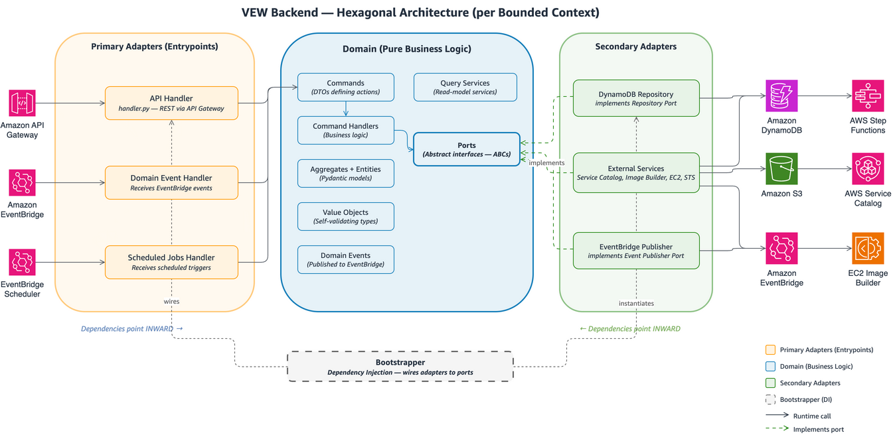

# VEW Backend

## Architecture

The backend is organized as a set of bounded contexts, each representing an independent business domain. Every context follows the same hexagonal architecture pattern:



### Dependency flow

```text
Entrypoints → Domain (ports) ← Adapters
```

Dependencies always point inward. Domain code has zero imports from adapters or entrypoints. This is enforced by architectural fitness function tests in `app/tests/test_module_import_fitness_function.py`.

### Bounded contexts

The backend contains these bounded contexts: `authorization`, `projects`, `packaging`, `publishing`, `provisioning`, `usecase`, and `shared`. See the [root README](../README.md#architecture-overview) for a summary of each context's purpose.

## Project structure

```text
backend/
├── app/                          # Application code
│   ├── {bounded_context}/        # One folder per context
│   │   ├── domain/               # Core business logic
│   │   │   ├── commands/         # Command definitions (DTOs)
│   │   │   ├── command_handlers/ # Business logic functions
│   │   │   ├── events/           # Domain events (EventBridge)
│   │   │   ├── exceptions/       # Domain-specific exceptions
│   │   │   ├── model/            # Entities and aggregates (Pydantic)
│   │   │   ├── ports/            # Interfaces (ABCs) for external deps
│   │   │   ├── query_services/   # Read-model services
│   │   │   ├── value_objects/    # Self-validating value types
│   │   │   └── tests/            # Domain unit tests
│   │   ├── adapters/             # Secondary adapters
│   │   │   ├── repository/       # DynamoDB implementations
│   │   │   ├── services/         # External service integrations
│   │   │   ├── query_services/   # Query service implementations
│   │   │   └── tests/            # Adapter unit tests
│   │   ├── entrypoints/          # Primary adapters
│   │   │   ├── api/              # REST API (handler.py, bootstrapper.py)
│   │   │   ├── domain_event_handler/  # EventBridge consumers
│   │   │   └── scheduled_jobs_handler/ # Scheduled Lambda triggers
│   │   └── libraries/
│   │       └── requirements.txt  # Context-specific dependencies
│   ├── shared/                   # Cross-cutting concerns
│   │   ├── adapters/             # Unit of Work, base repositories
│   │   ├── api/                  # API response helpers
│   │   ├── ddd/                  # Command bus, message bus
│   │   ├── domain/               # Shared domain primitives
│   │   ├── helpers/              # Utility functions
│   │   ├── instrumentation/      # Metrics, tracing
│   │   ├── logging/              # Structured logging
│   │   ├── middleware/           # Lambda middleware
│   │   └── test_utils/           # Shared test fixtures
│   └── tests/                    # Architecture fitness function tests
│
├── infra/                        # CDK infrastructure
│   ├── backend/                  # One stack per bounded context
│   │   ├── projects_app_stack.py
│   │   ├── packaging_app_stack.py
│   │   ├── publishing_app_stack.py
│   │   ├── provisioning_app_stack.py
│   │   ├── authorization_app_stack.py
│   │   └── ...
│   ├── constructs/               # Reusable CDK constructs
│   │   ├── backend_app_function.py    # Lambda function construct
│   │   ├── backend_app_openapi.py     # OpenAPI-driven API Gateway
│   │   ├── backend_app_storage.py     # DynamoDB table construct
│   │   ├── backend_app_event_bus.py   # EventBridge construct
│   │   └── ...
│   ├── auth/                     # Cedar authorization schemas
│   ├── helpers/                  # OpenAPI parser, monitoring helpers
│   ├── config.py                 # Environment configuration
│   └── constants.py              # Resource naming constants
│
├── setup/
│   └── prerequisites/
│       └── vew-spoke-account-bootstrap.yml  # Spoke account CF template
│
├── backend_app.py                # CDK app entry point (main stacks)
├── usecase_app.py                # CDK app entry point (usecase stacks)
├── vpc_app.py                    # CDK app entry point (VPC stack)
├── requirements.txt              # All Python dependencies
├── requirements-dev.txt          # Dev/test dependencies
├── pytest.ini                    # pytest configuration
├── mypy.ini                      # mypy strict type checking
├── bandit.ini                    # Security scanning config
└── .pre-commit-config.yaml       # Pre-commit hooks
```

## Setup

```bash
python3 -m venv .venv
source .venv/bin/activate
pip install -r requirements.txt -r requirements-dev.txt
```

## Tests

```bash
# Run all tests in parallel
python -m pytest app -v -s -n auto

# Run tests for a specific bounded context
python -m pytest app/projects -v -s

# Run architecture fitness function tests only
python -m pytest app/tests -v -s
```

The fitness function tests enforce:

- Hexagonal architecture compliance (domain must not import from adapters)
- Bounded context isolation (no cross-context imports)

## Code quality

```bash
# Run all pre-commit hooks (black, isort, flake8, bandit, mypy)
pre-commit run --all-files

# Individual tools
black --line-length 120 app/
isort app/
flake8 app/
mypy app/
bandit -c bandit.ini -r app/
```

Configuration:

- Line length: 120 characters
- Black formatter with isort for import sorting
- mypy strict mode for type checking
- bandit for security scanning

## CDK deployment

The backend has three CDK apps for different deployment scopes:

```bash
# Main backend stacks (all bounded contexts)
cdk synth --app "python backend_app.py" \
  -c environment=dev \
  -c account=<ACCOUNT_ID> \
  -c region=<REGION> \
  -c image-service-account=<ACCOUNT_ID> \
  -c image-service-region=<REGION> \
  -c catalog-service-account=<ACCOUNT_ID> \
  -c catalog-service-region=<REGION> \
  -c organization-id=<ORG_ID>

# Usecase stacks (customer-specific configurations)
cdk synth --app "python usecase_app.py" \
  -c environment=dev \
  -c account=<ACCOUNT_ID> \
  -c region=<REGION>

# VPC stack (development VPC, not for production)
cdk synth --app "python vpc_app.py" \
  -c environment=dev \
  -c account=<ACCOUNT_ID> \
  -c region=<REGION>
```

For full automated deployment, use `deploy.sh` from the repository root.

### CDK stacks deployed

| Stack | Resources |
| ------- | ----------- |
| `prerequisites` | SSM parameters, shared IAM roles |
| `security` | KMS keys, WAF ACLs |
| `authorization` | Verified Permissions policy store, authorizer Lambda |
| `projects` | API Gateway, Lambda, DynamoDB, EventBridge rules, Step Functions |
| `packaging` | API Gateway, Lambda, DynamoDB, S3 (components/recipes), Image Builder roles |
| `publishing` | API Gateway, Lambda, DynamoDB, S3 (templates), Service Catalog |
| `provisioning` | API Gateway, Lambda, DynamoDB, EventBridge rules, Step Functions |
| `catalog-service-regional` | SNS topics for Service Catalog notifications |
| `image-key` | KMS key for AMI encryption |
| `image-sharing` | Cross-account AMI sharing roles |
| `integration` | Cross-context integration (EventBridge pipes, permissions) |

### Configuration

Environment-specific configuration lives in `infra/config.py`. The deploy script patches `ORGANIZATION_PREFIX`, `APPLICATION_PREFIX`, and region settings automatically. For advanced tuning, see the [root README configuration reference](../README.md#configuration-reference).

Resource naming follows the pattern: `{org}-{app}-{component}-{name}-{env}`

## Extending the backend

### Adding a new bounded context

Create the directory structure under `app/{context_name}/`:

```text
app/{context_name}/
├── __init__.py
├── domain/
│   ├── commands/           # Command definitions (DTOs)
│   ├── command_handlers/   # Business logic (pure functions)
│   ├── events/             # Domain events
│   ├── exceptions/         # Domain-specific exceptions
│   ├── model/              # Entities and aggregates (Pydantic)
│   ├── ports/              # Interfaces (abstract base classes)
│   ├── query_services/     # Read-model services
│   ├── value_objects/      # Self-validating value types
│   └── tests/
├── adapters/
│   ├── repository/         # DynamoDB implementations
│   ├── services/           # External service integrations
│   └── tests/
├── entrypoints/
│   ├── api/
│   │   ├── handler.py      # Lambda entry point
│   │   ├── bootstrapper.py # Dependency wiring
│   │   ├── config.py       # API configuration
│   │   └── schema/         # OpenAPI schema (YAML)
│   └── domain_event_handler/
└── libraries/
    └── requirements.txt
```

Then implement the three layers:

#### Entrypoint (handler.py)

Thin Lambda handler that validates input, creates a command, and dispatches it:

```python
app = APIGatewayRestResolver()
dependencies = bootstrapper.bootstrap()

@app.post("/my-resource")
def create():
    command = CreateMyResourceCommand(
        resource_id=resource_id_value_object.from_str(app.current_event.json_body.get("resourceId")),
        created_by=user_id_value_object.from_str(app.current_event.request_context.authorizer.get("userId")),
    )
    dependencies.command_bus.handle(command)
    return {"statusCode": 201}
```

#### Command handler

Pure business logic function with injected dependencies:

```python
def handle(command: CreateMyResourceCommand, uow: UnitOfWork):
    entity = MyEntity(
        resourceId=command.resource_id.value,
        status=Status.CREATING,
        createDate=datetime.now(timezone.utc).isoformat(),
    )
    with uow:
        uow.get_repository(MyEntity).add(entity)
        uow.commit()
```

#### Bootstrapper

Wires concrete adapters to domain ports:

```python
def bootstrap() -> Dependencies:
    dynamodb = boto3.resource("dynamodb")
    table_name = os.environ["TABLE_NAME"]
    uow = DynamoDBUnitOfWork(table_name, dynamodb.meta.client)
    cmd_bus = InMemoryCommandBus()
    cmd_bus.register_handler(CreateMyResourceCommand, lambda cmd: handle(cmd, uow))
    return Dependencies(command_bus=cmd_bus)
```

#### CDK stack

Add a stack in `infra/backend/{context_name}_app_stack.py` using the reusable constructs:

- `backend_app_openapi.py` — Creates an API Gateway from your OpenAPI schema
- `backend_app_storage.py` — Creates a DynamoDB table
- `backend_app_function.py` — Creates a Lambda function with the correct bundling
- `backend_app_event_bus.py` — Creates EventBridge rules

Register the stack in `backend_app.py`. Use existing stacks (e.g., `projects_app_stack.py`) as a reference.

#### OpenAPI schema and API model

Define your API contract in `entrypoints/api/schema/{context}-api-schema.yaml`, then generate the Python model:

```bash
datamodel-codegen \
  --input app/{context}/entrypoints/api/schema/{context}-api-schema.yaml \
  --output app/{context}/entrypoints/api/model/api_model.py \
  --output-model-type pydantic_v2.BaseModel
```

Add schema validation tests in `entrypoints/api/tests/test_schema.py` — see existing contexts for the pattern.

### Adding a domain event

To emit events for cross-context communication:

1. Define the event in `domain/events/`
1. Publish to EventBridge from the command handler
1. Create an EventBridge rule in the CDK stack to route the event
1. Implement a `domain_event_handler/` entrypoint in the consuming context

### Architecture fitness functions

The tests in `app/tests/test_module_import_fitness_function.py` automatically verify:

- No bounded context imports from another bounded context
- No domain layer imports from adapter or entrypoint layers

These tests run as part of the standard test suite and will fail the build if architectural rules are violated.
