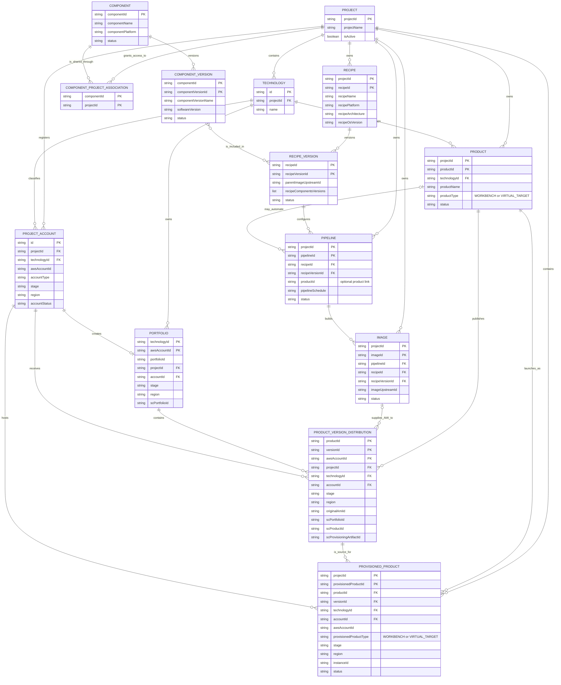

# VEW domain relationships

This diagram focuses on the persisted domain entities and their cardinalities.
`ProductVersionDistribution` represents the publishing domain's `Version`
entity. A logical product version is stored once for each AWS account to which
it is distributed, using `(productId, versionId, awsAccountId)` as its key.

## Interpretation notes

- `Technology` groups products. It has no workbench or virtual-target type.
- `ProjectAccount` is the VEW association between a technology and a spoke AWS
  account for a stage and region.
- Onboarding a project account causes a Service Catalog `Portfolio` to be
  created for that technology and AWS account.
- A `Pipeline` always builds a particular recipe version. Its optional
  `productId` enables a completed image build to create a product version
  automatically.
- A publishing `Version` is a distribution record, not only a semantic version:
  it carries the target account, stage, region, portfolio, Service Catalog
  product, and provisioning artifact identifiers.
- `Product.productType` determines whether launches appear as workbenches or
  virtual targets. Both types follow the same publishing and provisioning
  relationships.

## Relevant implementation

- Projects: `backend/app/projects/domain/model/`
- Packaging: `backend/app/packaging/domain/model/`
- Publishing: `backend/app/publishing/domain/model/`
- Provisioning: `backend/app/provisioning/domain/model/provisioned_product.py`
