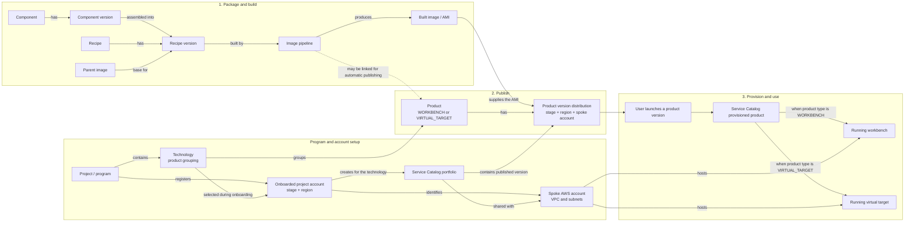

# VEW product lifecycle

This diagram shows how VEW turns reusable software components into running
workbenches and virtual targets. A technology is a product grouping; it does
not restrict the product type. One technology can therefore contain both
`WORKBENCH` and `VIRTUAL_TARGET` products.

The onboarding association establishes where versions for a technology are
published. Launching a product does not onboard the account again: every launch
creates another provisioned product in the spoke account selected by the
published version distribution.

## Relevant implementation

- Packaging entities: `backend/app/packaging/domain/model/`
- Technology and account association: `backend/app/projects/domain/model/`
- Portfolio, product, and version distribution: `backend/app/publishing/domain/model/`
- Runtime instance: `backend/app/provisioning/domain/model/provisioned_product.py`
